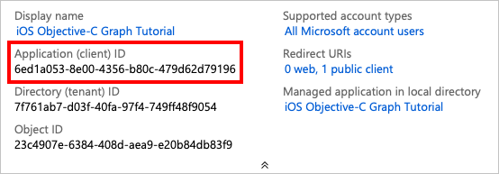

<!-- markdownlint-disable MD002 MD041 -->

この手順では、Azure Active Directory 管理センターを使用して、新しい Azure AD ネイティブアプリケーションを作成します。In this exercise you will create a new Azure AD native application using the Azure Active Directory admin center.

1. ブラウザーを開き、[Azure Active Directory 管理センター](https://aad.portal.azure.com)へ移動して、**個人用アカウント** (別名: Microsoft アカウント)、または**職場/学校アカウント**を使用してログインします。Open a browser and navigate to the [Azure Active Directory admin center](https://aad.portal.azure.com) and login using a **personal account** (aka: Microsoft Account) or **Work or School Account**.

1. 左側のナビゲーションで [ **Azure Active Directory** ] を選択し、[**管理**] の下にある [**アプリの登録**] を選択します。Select **Azure Active Directory** in the left-hand navigation, then select **App registrations** under **Manage**.

    

1. **[新規登録]** を選択します。Select **New registration**. **[アプリケーションを登録]** ページで、次のように値を設定します。On the **Register an application** page, set the values as follows.

    - `iOS Objective-C Graph Tutorial` に **[名前]** を設定します。Set **Name** to `iOS Objective-C Graph Tutorial`.
    - [**サポートされているアカウントの種類**] を [**任意の組織のディレクトリ内のアカウントと個人用の Microsoft アカウント**] に設定します。Set **Supported account types** to **Accounts in any organizational directory and personal Microsoft accounts**.
    - [**リダイレクト URI**] で、ドロップダウンを [**パブリッククライアント (モバイル & デスクトップ)**] に変更し`msauth.YOUR_BUNDLE_ID://auth`、値`YOUR_BUNDLE_ID`をに設定して、アプリのバンドル ID で置き換えます。Under **Redirect URI**, change the dropdown to **Public client (mobile & desktop)**, and set the value to `msauth.YOUR_BUNDLE_ID://auth`, replacing `YOUR_BUNDLE_ID` with the bundle ID for your app.

    ![[アプリケーションの登録] ページのスクリーンショット](./images/aad-register-an-app.png)

1. [**登録**] を選択します。Select **Register**. IOS の「 **C Graph のチュートリアル**」ページで、**アプリケーション (クライアント) ID**の値をコピーして保存します。そのためには、次の手順で必要になります。On the **iOS Objective-C Graph Tutorial** page, copy the value of the **Application (client) ID** and save it, you will need it in the next step.

    
